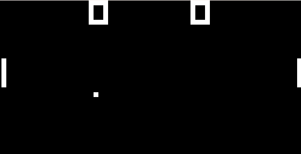

<p align="center">
A Chip-8 Emulator using Python
</p>

<div align="center">

  <a href=""></a>
  <a href=""></a>

</div>

## About the Project
This is my very rough attempt at emulating the Chip-8 system from the 1970s. The Chip-8 system can run various retro games including Pong, Tetris, Pac-Man, Brick Breaker, and more. 
This project came to fruition with the goal of understanding computers at a more fundamental level, and I think that I reached that goal. 
Although Chip-8 is considered the most basic emulation project, I learned a lot about computer architecture along the way. 


<div align="center">
  
  
  
  <!--  -->

</div>

## Getting Started
### Prerequisites
- Pygame
### Installation
1. Clone this repository
```bash
git clone https://github.com/AndersHaroldson/Chip-8.git
```
2. Change directory into the cloned repo
```bash
cd Chip-8
```
3. Put the path to the buzz.wav file as well as the ROM file you want 
```python
pygame.mixer.music.load("Insert buzz file path here")
```
```python
self.loadROM("Insert ROM path here")
```
4. Run the file!
```bash
 python Chip-8.py
```

## Acknowledgements
- [Cowgod's Chip-8 Reference](http://devernay.free.fr/hacks/chip8/C8TECH10.HTM#0.0)
- [Wikipedia Opcodes](https://en.wikipedia.org/wiki/CHIP-8#Opcode_table)
- [Timendus' CHIP-8 Test Suite](https://github.com/Timendus/chip8-test-suite#chip-8-splash-screen)
- [Emulation Basics: Write your own Chip 8 Emulator/Interpreter](https://omokute.blogspot.com/2012/06/emulation-basics-write-your-own-chip-8.html)
- [freeCodeCamp: How to Create Your Very Own Chip-8 Emulator](https://www.freecodecamp.org/news/creating-your-very-own-chip-8-emulator/)

